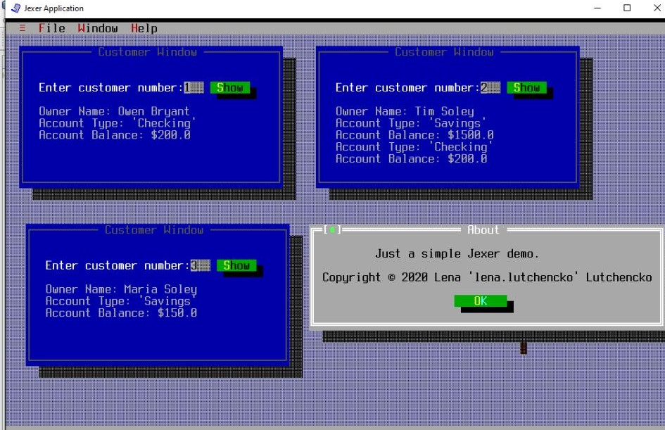

# UI Lab 1
## Опис виконання лабораторної роботи:
### Обране завдання - на п'ять:
* Завантажено jar-файл Jexer і підключено до створеного проекту з назвою TUIdemo.
* Підключено даний файл TUIdemo.java до проекту.
* Досліджено код цього файлу та впевнилась у його працездатності 
* Переписано метод ShowCustomerDetails з використанням класів Bank, Customer, Account та ін. з наших попередніх лаб - банк має як мінімум два клієнти, інформацію про яких (та про перші рахунки, що їм належать) ви можете побачити, увівши номер клієнта.
* Переписано метод ShowCustomerDetails з використанням класів Bank, Customer, Account та ін. з наших попередніх лаб - інформація про клієнтів банку та їх рахунках читається з файлу test.dat 
* Запущено проект - все працює як очікувалось. 

## Результат

